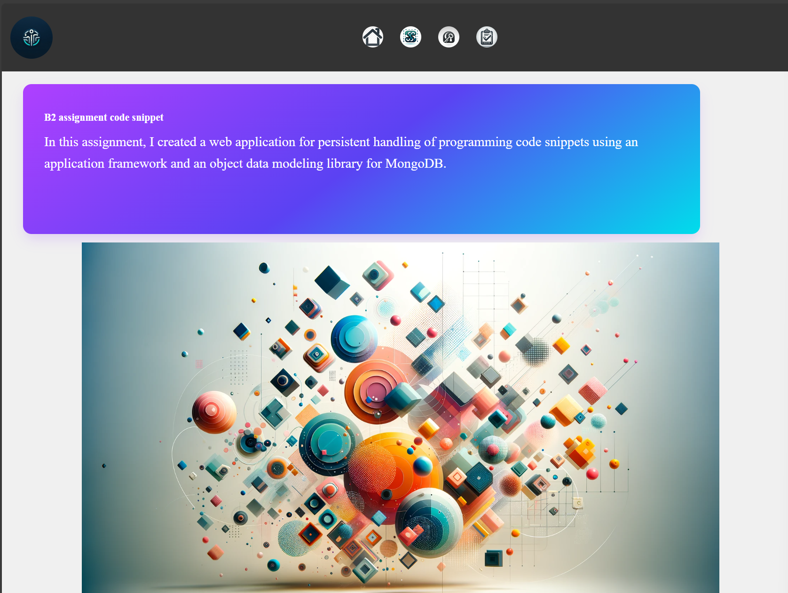

# B2 CRUD

## Start the application
1. clone the repo
2. cd to the directory to where you cloned the repo
3. npm install
4. npm run 

Just copy the link and you will be directed to the web site.

## Note
Change the URI for the data base and put your own URI you can find it in the .env file.
